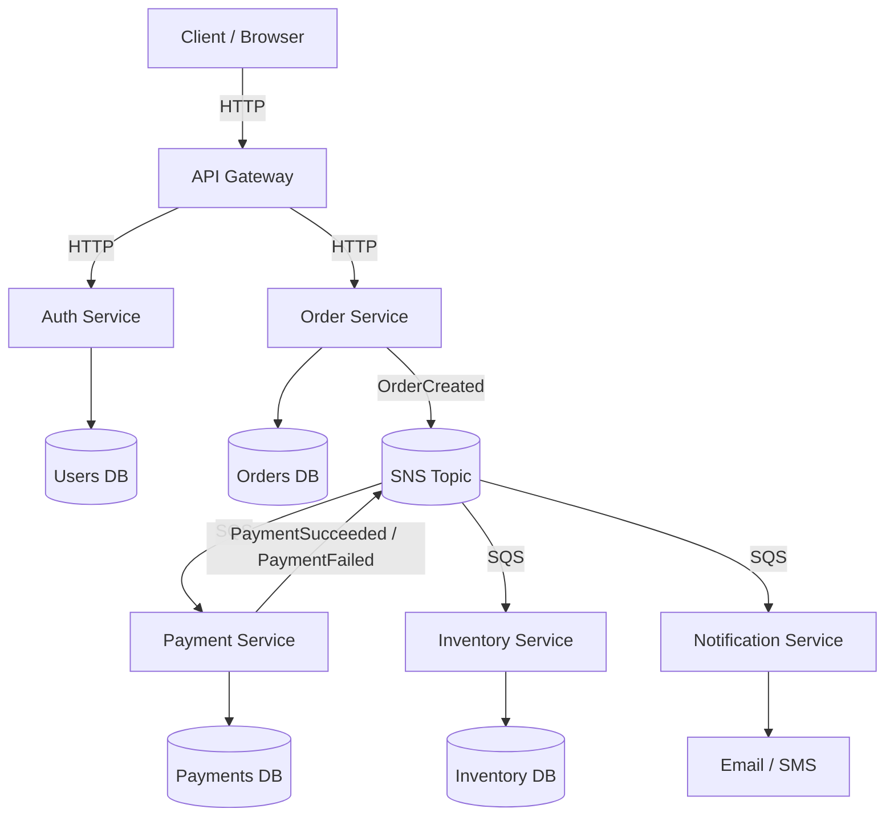

```mermaid
    graph TD
    Client[Client / Browser] -->|HTTP| APIGW[API Gateway]

    APIGW -->|HTTP| Auth[Auth Service]
    APIGW -->|HTTP| Order[Order Service]

    %% Datastores
    Auth --> AuthDB[(Users DB)]
    Order --> OrderDB[(Orders DB)]
    Payment --> PaymentDB[(Payments DB)]
    Inventory --> InventoryDB[(Inventory DB)]

    %% Event Bus
    Order -->|OrderCreated| SNS[(SNS Topic)]

    SNS -->|SQS| Payment[Payment Service]
    SNS -->|SQS| Inventory[Inventory Service]
    SNS -->|SQS| Notification[Notification Service]

    Payment -->|PaymentSucceeded / PaymentFailed| SNS

    Notification --> User[Email / SMS]
```
